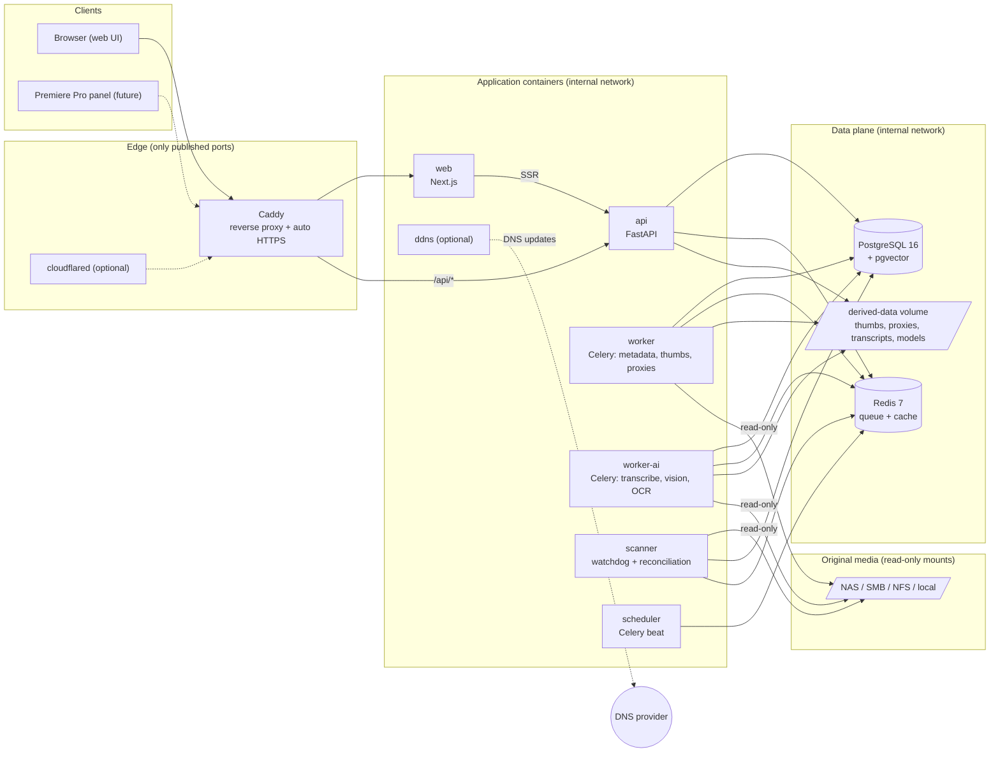
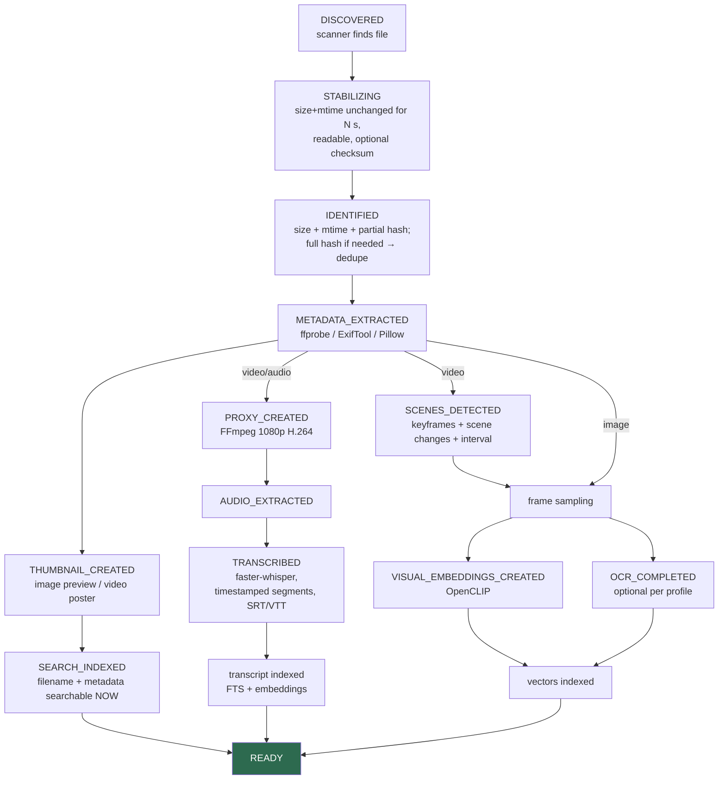

# FrameFound Architecture

Status: Milestone 0 draft. Decisions with lasting consequences are recorded as
[ADRs](adr/); this document is the map.

## Design principles (non-negotiable)

1. **Originals in place** — media is indexed where it lives (NAS/SMB/NFS/local),
   mounted read-only. All generated files go to an app-managed data directory.
2. **Rebuildable** — the database is a cache of truth derived from originals +
   sidecars. Losing it is an inconvenience, not a catastrophe.
3. **Local-first** — all AI runs locally by default; cloud providers are
   opt-in plugins with explicit disclosure.
4. **One application** — many containers, one install, one admin UI. Users never
   see Postgres, Redis, Celery, or FFmpeg terminology.
5. **Secure by default** — no default passwords, no exposed internal ports,
   authorization on every byte served.

## System architecture



Key properties:

- **Only Caddy publishes ports** (80/443). Postgres, Redis, API, and workers are
  reachable solely on the internal Docker network.
- **One server image, many entrypoints** — `api`, `worker`, `worker-ai`,
  `scanner`, `scheduler`, `ddns` are the same Python image with different
  commands ([ADR-0001](adr/0001-monorepo-single-server-image.md)).
- **Derived data is relocatable** — the DB stores paths relative to the data
  volume, never absolute host paths.

## Processing pipeline



Pipeline rules:

- Stages are **independent Celery tasks**; an optional-stage failure (e.g.
  transcription) degrades the asset, never blocks it. Filename/metadata search
  works minutes after discovery; AI enrichment streams in afterward.
- Every task is **idempotent** (keyed on asset id + stage + model version) and
  **resumable** — restart-safe by construction.
- **Processing profiles** (photo / standard video / sermon / drone) select which
  stages run and with what parameters.
- Model + version recorded on every AI output so assets can be selectively
  reprocessed when models change.

## Search architecture (MVP)

Single PostgreSQL instance handles all three retrieval modes
([ADR-0003](adr/0003-postgres-pgvector.md)):

1. **Exact/quoted** — trigram + `tsquery` phrase match over filenames, transcripts, captions, OCR, tags.
2. **Full-text relevance** — `tsvector` + `ts_rank` across all text surfaces.
3. **Semantic** — pgvector HNSW cosine search over CLIP image/frame embeddings
   and text-embedding transcript segments.

Hybrid ranking merges the three result sets with **Reciprocal Rank Fusion**
(weights configurable later). A `SearchBackend` interface isolates this so
OpenSearch can be added post-1.0 without touching callers.

## Technology stack (summary — details in ADRs)

| Layer | Choice | ADR |
|---|---|---|
| Backend | Python 3.12, FastAPI, SQLAlchemy 2 + Alembic, Pydantic v2 | 0002 |
| Frontend | Next.js (App Router), TypeScript strict, Tailwind + shadcn/ui, TanStack Query | 0006 |
| Database | PostgreSQL 16 + pgvector (single store: relational + FTS + vectors) | 0003 |
| Queue | Redis 7 + Celery (beat for schedules) | 0004 |
| Media | FFmpeg/FFprobe, ExifTool, Pillow, PySceneDetect | 0007 |
| ASR | faster-whisper behind a `TranscriptionProvider` interface | 0008 |
| Vision | OpenCLIP behind an `EmbeddingProvider` interface | 0008 |
| Reverse proxy | Caddy 2 (automatic HTTPS) | 0005 |
| Auth | Local accounts, argon2id, server-side sessions, TOTP later; OIDC post-MVP | 0009 |

## Repository layout

```
apps/
  server/                 # ONE Python package: framefound
    framefound/
      main.py             # FastAPI app factory
      config.py           # pydantic-settings, env-driven
      api/v1/             # versioned routes
      db/                 # models, session, Alembic migrations
      worker.py           # Celery app + task registration
      scanner/            # watcher + reconciliation + stability
      processing/         # ffmpeg/exiftool wrappers, profiles
      ai/                 # provider interfaces + local implementations
      search/             # SearchBackend interface + Postgres impl
      auth/               # sessions, password hashing, rate limits
      ddns.py             # DDNS sidecar entrypoint
    tests/
  web/                    # Next.js frontend
  adobe-panel/            # future; research notes only for now
infrastructure/
  caddy/  scripts/  proxmox/
docs/
fixtures/                 # small redistributable test media (planned)
```

Deviation from the original brief's layout — `services/{scanner,transcriber,vision,proxy-generator}`
as separate codebases and a `packages/` tree — is deliberate: those services share 90% of their
dependencies (DB models, config, media probing) and would each need their own image, CI lane, and
release coordination. One package + queue-segregated workers gives the same runtime isolation with
a fraction of the maintenance. `packages/` gets reintroduced only when a second consumer actually
exists (the Adobe panel will consume the HTTP API, not Python packages).
