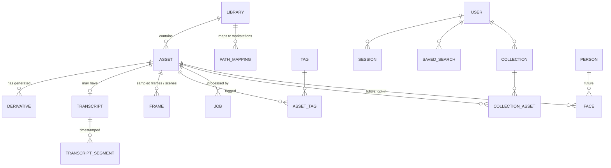

# Data Model (Milestone 0 draft)

System of record: PostgreSQL 16 + pgvector. All derived paths stored **relative
to the data volume**; all original paths stored **relative to the library root**.

## Entity overview

## Tables

### `libraries`
name, root_path (server), storage_type, read_only, include_extensions,
exclude_globs, scan_schedule, watcher_enabled, processing_profile_id,
retention_policy, client/project association, timezone, enabled.

### `path_mappings`
library_id, profile_name ("Windows Desktop", "MacBook Pro"), platform, prefix
replacement (`/media/intel` → `Z:\Intel`). Consumed by `/assets/{id}/paths`
and, later, the Premiere panel.

### `assets`
Identity: id (UUID, stable primary identifier — never the path), library_id,
relative_path, filename, extension, mime_type, media_type (image|video|audio),
size, mtime, ctime, first_indexed_at, last_verified_at, content_hash (BLAKE3),
partial_hash (first+last 1 MiB), availability (online|missing|unmounted),
processing_status.
Technical: duration, width, height, fps, video_codec, audio_codec, sample_rate,
channels, bitrate, orientation.
Capture: camera_make/model, lens, focal_length, aperture, shutter, iso,
gps_lat/lon (nullable), captured_at.
Curation: rating, favorite, archived, title, description, custom_fields (JSONB).
Indexes: (library_id, relative_path) unique; content_hash; captured_at;
media_type + captured_at; tsvector GIN over filename+title+description.

### `derivatives`
asset_id, kind (thumbnail|poster|preview|proxy|editing_proxy|waveform|
extracted_audio|subtitle|transcript_json|scene_thumb|contact_sheet),
relative_path (under data volume), format, width/height, codec, status,
generated_at, size, checksum, expires_at. Unique (asset_id, kind, variant).

### `transcripts`
asset_id, language, language_confidence, model, model_version, processed_at,
full_text, full_text_tsv (GIN), segment_count, diarized, version,
user_corrected.

### `transcript_segments`
transcript_id, start_ms, end_ms, text, speaker (nullable), confidence,
embedding vector(768) HNSW, text_tsv GIN. This is the unit of
"jump to 00:02:17" search results.

### `frames`
asset_id, ts_ms, end_ts_ms, scene_number, thumb relative path, phash,
embedding vector(512) HNSW (CLIP space), caption (nullable), ocr_text
(nullable), labels JSONB with confidences. Images get exactly one row
(ts_ms = 0), unifying image and video-frame vector search in one table.

### `tags` / `asset_tags`
tags: name, parent_id (hierarchy), source (user|ai|system|imported).
asset_tags: asset_id, tag_id, confidence, source_model, reviewed.

### `jobs`
id, asset_id, type, queue, status, priority, attempts, worker, created/started/
finished_at, progress, error_summary, log_excerpt, model_version, next_retry_at.
Mirrors Celery state into Postgres so the dashboard needs no broker access.

### `users` / `sessions`
users: email, password_hash (argon2id), role (admin|user|readonly), totp_secret
(nullable, encrypted), disabled, created_at, last_login.
sessions: opaque token hash, user_id, expires_at, ip, user_agent, revoked.

### `saved_searches`, `collections`, `collection_assets`, `audit_log`, `settings`
Straightforward; `settings` is a typed key-value table for wizard-managed
config (remote access mode, processing schedule, concurrency caps).

### Faces (schema reserved, feature post-MVP, admin opt-in)
`people` (name, user-confirmed) and `faces` (asset_id, frame_id, bbox,
embedding, person_id nullable, cluster_id). Biometric rows are hard-deleted on
disable — see threat model §privacy.

## Embedding dimension note

Vector columns are created per model family; changing embedding models creates
a new column/index and a background re-embed job rather than an in-place
overwrite, so old and new vectors can coexist during migration
(model + version recorded on every row).
